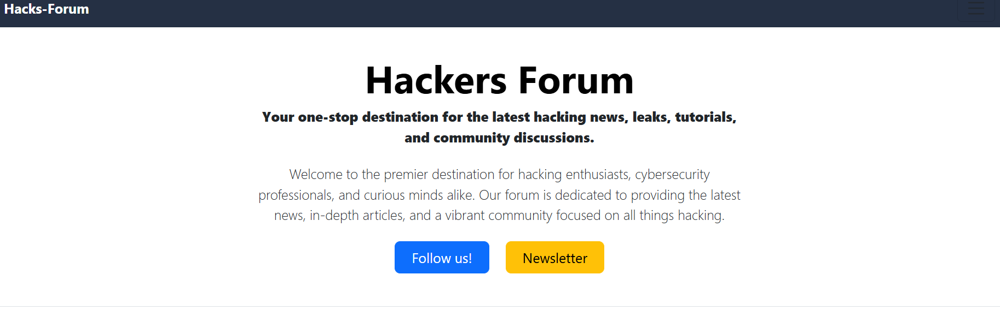
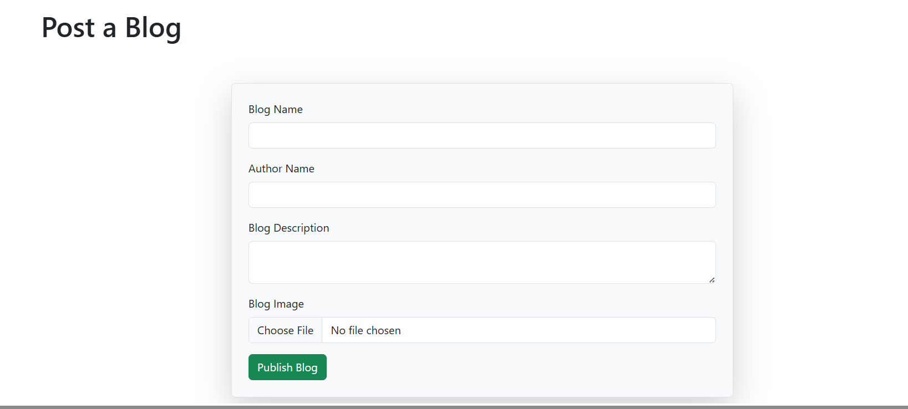
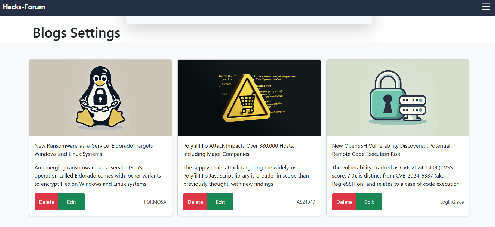
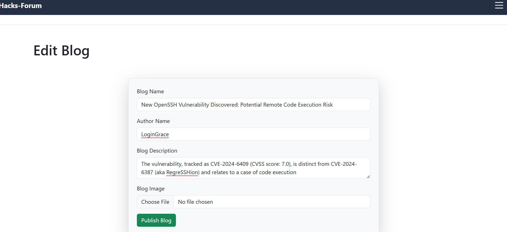
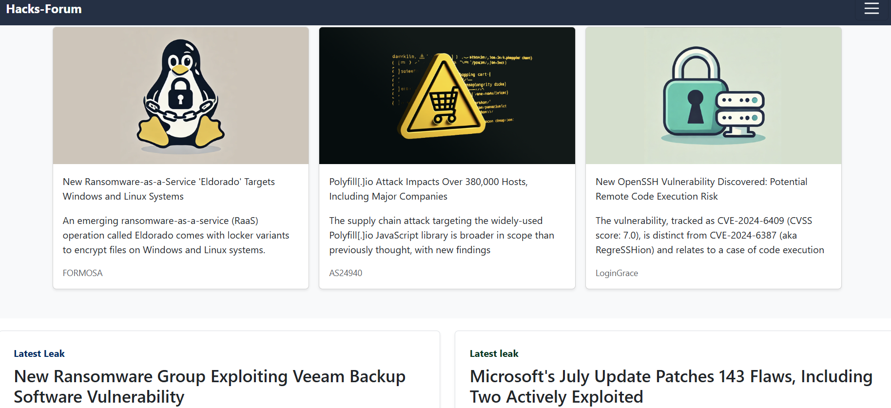

# Hacks-Forum

Welcome to Hacks-Forum, your go-to source for uncovering and sharing cutting-edge insights and leaks across finance, politics, and beyond. This repository houses the codebase for the Hacks-Forum website, developed using Django, HTML, CSS, and Bootstrap.

# Tech Stack
Backend: Django
Frontend: HTML, CSS, Bootstrap
Pages
1. Landing Page

The landing page serves as the entry point to Hacks-Forum, providing an overview of the site's offerings and navigation to other sections.

2. Blog Publish Page

Users can publish new blog posts through this page, contributing to the platform's content.

3. Settings Page

The settings page allows users to customize their profile and preferences within the Hacks-Forum platform.

4. Edit Page

Users can edit existing blog posts using this page, ensuring content remains up-to-date and relevant.

5. Home Page

The home page dynamically displays latest updates, featured articles, and trending topics, ensuring visitors stay informed and engaged.

# Getting Started
To run the Hacks-Forum website locally:

# Clone the repository:

bash
Copy code
git clone [(https://github.com/ranasuryansh14/HACKS-FORUM-Django-Website]
cd hacks-forum
Install dependencies

# Migrate
bash
Copy code
python manage.py migrate
Start the development server:

# Run Website
bash
Copy code
python manage.py runserver
Open your browser:
Visit http://localhost:8000 to view the Hacks-Forum website.

Contributing
Contributions are welcome! Please fork the repository and submit a pull request with your changes. For major updates, please open an issue first to discuss what you would like to change.

License
This project is licensed under the MIT License - see the LICENSE file for details.

